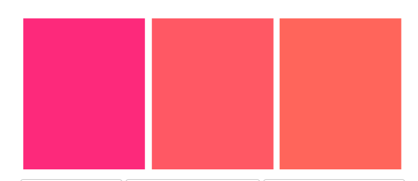

## Tind-KedIn

### Duración:
24 hrs.

### Requerimientos funcionales:
- Landing page que muestre la data proporcionada con el cliente
- El usuario debe poder la información ordenada
- El usuario debe poder acceder a través de una url.

### Requerimientos no funcionales:
- Debe ser responsivo (Mobile first, tablet, desktop)

### Tecnologías utilizadas:
- ReactJs
- JavaScript ES6
- MaterialUI Css Framework
- Axios
- Flexbox

### Prototipo de baja fidelidad:
En progreso :D

### Paleta de colores:
Se utilizó la paleta de colores de Tinder. Electric Pink, Fiery Rose y Pastel Red.

### ¿Cómo iniciar ?
- clonar repositorio
- npm install
- npm start

